# RemoveSky-integratie: getest schema

Testdatum: 14 juni 2026  
RemoveSky-versie: `v0.3.1` (`4b7dba3`)  
Productie-API: `https://removesky.vanburik.info/api/v1`

```mermaid
flowchart LR
    A["Testfoto met EXIF GPS"] --> B["EXIF-orientatie normaliseren"]
    B --> C["POST /api/v1/upload<br/>foto + location + lat + lon"]

    H["Cloudflare Access headers<br/>optioneel x-api-key"] --> C

    C --> D{"Geldige landschapsfoto<br/>met lucht?"}
    D -- Nee --> E["HTTP 400<br/>reden vastgelegd"]
    D -- Ja --> F["Lucht verwijderen"]
    F --> G["Transparante PNG opslaan<br/>Processed/location/hash.png"]
    G --> I["DB-record opslaan"]

    I --> J{"Locatie ingevuld EN<br/>processed_image ingevuld?"}
    J -- Nee --> K["Database weigert record"]
    J -- Ja --> L["Record beschikbaar via<br/>GET /api/v1/db"]

    L --> M["Processed URL downloaden<br/>met dezelfde headers"]
    M --> N{"Content-Type image/*<br/>en bestand niet leeg?"}
    N -- Nee --> O["Test mislukt"]
    N -- Ja --> P["Android converteert naar WebP"]
    P --> Q["Opslaan in locatiecache"]
    Q --> R["Actieve cachevelden atomair wijzigen"]
    R --> S["Live wallpaper leest nieuwe<br/>lokale afbeelding"]
```



## Uitgevoerde controles

| Controle | Resultaat |
|---|---|
| `GET /api/v1/health` via Cloudflare Access | Geslaagd, status `ok` |
| `GET /api/v1/version` | Geslaagd, versie `0.3.1` |
| Upload `20260614_134339.jpg` | Geslaagd |
| Upload `20260614_220000.jpg` na EXIF-rotatie | Geslaagd |
| Verwerkte afbeelding downloaden | Geslaagd |
| Content-Type van verwerkte afbeelding | Geldig afbeeldingsresponse |
| DB-record terugvinden via `/api/v1/db` | Geslaagd |
| Niet-lege locatie in DB | Geslaagd: `Hoofddorp` |
| Niet-leeg `processed_image` in DB | Geslaagd |
| DAO weigert verwerkt record zonder locatie | Geslaagd |
| DAO weigert verwerkt record zonder afbeelding | Geslaagd |
| SQLite-trigger weigert leeg verwerkt record | Geslaagd |
| Android `assembleBasicDebug` | Geslaagd |
| Secrets afdrukken in testscript | Niet gedaan |

## Geteste foutflow

De ruwe `20260614_220000.jpg` bevatte een EXIF-rotatie. Zonder normalisatie zag de
service geen lucht bovenaan en antwoordde correct met:

```text
HTTP 400
reason: no_sky_at_top
```

Na dezelfde oriëntatienormalisatie als in de Android-camera slaagde de volledige flow.

## Nog op telefoon testen

1. Foto maken vanuit `CameraActivity`.
2. Wachten tijdens de verwerking van ongeveer 40 seconden.
3. Controleren dat de app een succesvolle opslag meldt.
4. Controleren dat de nieuwe foto direct de actieve wallpaper wordt.
5. App en wallpaper herstarten en controleren dat dezelfde WebP-cache behouden blijft.
6. Timeout-, offline- en Cloudflare-403-meldingen visueel controleren.

## Bekend configuratiepunt

De server retourneerde tijdens de test nog een processed URL met `http://`. De Android-client
normaliseert die naar de geconfigureerde HTTPS-origin. Configureer op de server daarnaast:

```text
REMOVESKY_BASE_URL=https://removesky.vanburik.info
```

Daarna horen API-responses direct HTTPS-URL's te bevatten.
