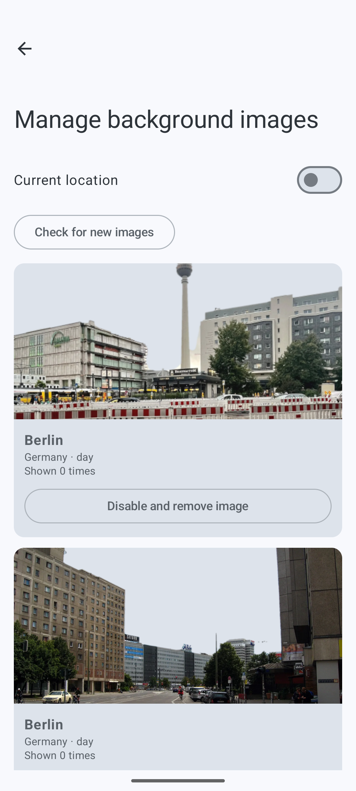

# Bugs doornemen — 26 juli 2026

Samenvatting van de sessie waarin bugs en features zijn doorgenomen voor
`removesky-service` en `LiveWeatherApp` (breezy-weather). Werkwijze: gebruiker
meldt een bug (vaak met screenshot), root cause wordt onderzocht, indien
snel/veilig meteen gefixt, en altijd gelogd als GitHub issue.

## removesky-service

### Issue #7 — CLIP is_outdoor te streng
Buiten-foto's werden onterecht afgekeurd door de CLIP outdoor-check.
**Fix:** `REJECT_ON_NOT_OUTDOOR = False` toegevoegd in `app/services/processing.py`
(check blijft in de code staan, maar afkeuren staat uit).

### Issue #8 — search-check batch hangt na ~45 sec
Bij het controleren van afbeeldingen in de zoekfunctie liep het proces vast na
ongeveer 45 seconden. **Root cause:** de laatste stap van `check_images_batch()`
(EXIF/dimensie-download per afbeelding) liep sequentieel i.p.v. parallel.
**Fix:** deze stap geparallelliseerd met een `ThreadPoolExecutor` (max 8 workers).

### Issue #9 — zelfde CLIP-probleem via ander pad
Bleek een tweede, aparte code-route te hebben (`sky.py`'s `assert_landscape()`,
aangeroepen door `process_upload()` bij het uploaden vanuit de app), die niet
gedekt werd door de fix van issue #7. **Fix:** `REJECT_ON_NOT_LANDSCAPE = False`
toegevoegd in `app/services/sky.py`, zelfde patroon als issue #7.

### Issue #10 — weetjes fact-check checkt onnodig alle vertalingen
Elk weetje heeft 10+ vertalingen; alleen de NL/EN-versie hoeft fact-gecheckt te
worden — als die klopt, kloppen de vertalingen ook.
**Fix:**
- `list_unchecked()` in `app/dao/weetjes_dao.py`: alleen primaire weetjes
  (`source_weetje_id IS NULL`) worden nog gecontroleerd.
- `set_fact_check()`: bij een "passed"-status wordt dit nu ook gecascadeerd naar
  alle vertalingen (`source_weetje_id = weetje_id`), net als eerder al gebeurde
  bij "failed".

### Issue #11 — "Sorteer zoals app"-knop in Kaart-pagina (feature)
Gebruiker wilde de prioriteits-/sorteerlogica van de app (welke foto als
achtergrond wordt gekozen) ook server-side kunnen zien en debuggen, met nadruk
op "current location".
**Geïmplementeerd:**
- Nieuw bestand `app/services/wallpaper_priority.py`: Python-port van de
  Kotlin `buildShowlist()`-logica (radius-ladder 1/2/5km, season/weather-
  relaxatie, day/night-matching). Expliciet gedocumenteerde beperking:
  `rating`/`view_count`/`last_shown_at` zijn device-local en kunnen server-side
  niet gereproduceerd worden (behandeld als "nooit gerate, nooit getoond").
- Nieuw endpoint `GET /manage/images/map/priority` in `app/api/v1/manage.py`
  — haalt automatisch de actuele live-weer conditie op via Open-Meteo als er
  geen `weather`-parameter is meegegeven (`meteo.fetch_current_weather()`,
  nieuw in `app/services/meteo.py`).
- Nieuwe knop "Sorteer zoals app" op de Kaart-pagina (`static/index.html`):
  toont de gesorteerde foto's met rangnummer op de kaart, popup met rank/id/
  matched-stage.

## LiveWeatherApp (breezy-weather)

### Issue #10 — Wallpaper-stotteren (nog niet opgelost)
Bij het wisselen van achtergrondfoto wordt eerst de achtergrond aangepast, dan
de voorgrond, wat zichtbaar hapert (zie video `langzamewolken-2607260937.mp4`).
**Root cause gevonden en gedocumenteerd in de issue:**
`setWeatherBackgroundDrawable()` dwingt een synchrone rebuild van de voorgrond-
foto af. **Gewenste oplossing (nog te implementeren):** voorgrond moet altijd
eerst goed werken; achtergrond moet op een aparte thread wisselen, bij voorkeur
met fade-out/fade-in.
**Status: alleen gelogd, fix nog niet gebouwd.**

### Issue #11 — "Interne meldingen"-scherm in About (nog niet opgelost)
Gebruiker krijgt af en toe meldingen als "can't update" maar kan de inhoud
nergens teruglezen. Gewenst: een knop "Interne meldingen" in het About-scherm,
gegroepeerd per dag (zoals Release notes), met bewaartermijn van 20 dagen.
**Status: alleen gelogd, nog niet geïmplementeerd.**

### Issue #12 — Thumbs-up/down rating verwijderen (opgelost)
Deze functionaliteit is geschrapt en moest volledig uit code en UI verwijderd
worden.
**Geïmplementeerd** in 6 bestanden:
- `WallpaperPhotoManagerActivity.kt` — thumbs-up/down-knoppen uit de UI
  verwijderd, `updateRating()` verwijderd.
- `WallpaperPhotoPriority.kt` — rating-tiers verwijderd uit zowel
  `selectWallpaperPhoto()` als `buildShowlist()`'s sortering.
- `WallpaperRepository.kt` (app-laag) — `setPhotoRating()` verwijderd.
- `WallpaperPhotoRepository.kt` (data-laag) — `rating`-veld verwijderd uit
  `WallpaperPhotoRecord`, `setRating()` verwijderd. De positionele SQLDelight-
  mapper-parameter blijft (verplicht, want kolom bestaat nog in het schema),
  maar wordt niet meer gebruikt.
- `wallpaper_photos.sq` — `rating`-kolom bewust **niet** verwijderd uit het
  schema (SQLite `DROP COLUMN` is niet overal veilig ondersteund); wel uit de
  `ORDER BY`-clausules gehaald en de `setRating`-query verwijderd. Kolom blijft
  staan als dode, altijd-0 kolom met uitleg-comment.
- `WallpaperPhotoPriorityTest.kt` — tests bijgewerkt/verwijderd waar ze op
  rating leunden; alle 10 resterende tests slagen.

**Getest:** debug-build gemaakt en op de emulator geïnstalleerd (niet op de
telefoon, conform afspraak dat debug-builds nooit op het echte toestel komen).
Geverifieerd via het "Manage background images"-scherm: geen thumbs-up/down-
knoppen meer zichtbaar, scherm werkt verder normaal.

**Commit:** `9087c231a` — "Remove thumbs up/down rating from wallpaper photo
priority + UI", gepusht naar `origin/main` op `strammermax/breezy-weather`.

Screenshot van de emulator-verificatie (thumbs-up/down knoppen zijn weg):

## Openstaand
- breezy-weather #10 (wallpaper-stotteren): fix nog implementeren.
- breezy-weather #11 (interne meldingen scherm): nog implementeren.
- removesky-service #11: vraag of "Sorteer zoals app" ook fixed-location-modus
  moet ondersteunen naast current-location (nu hardcoded op current-location).
